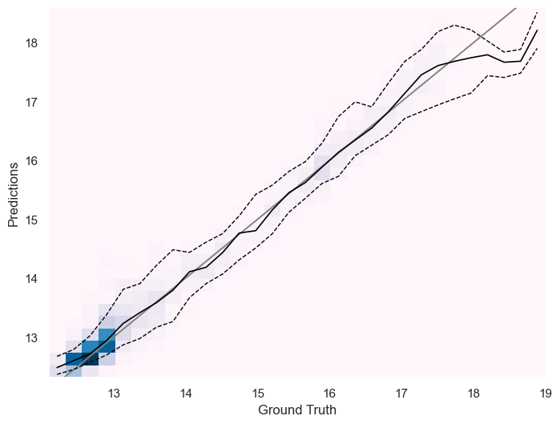
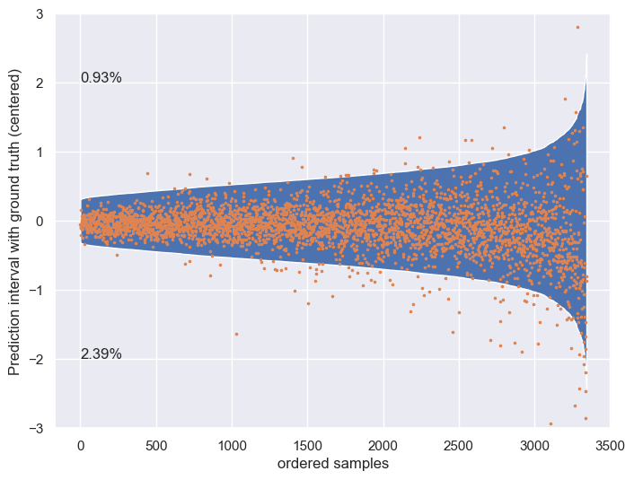
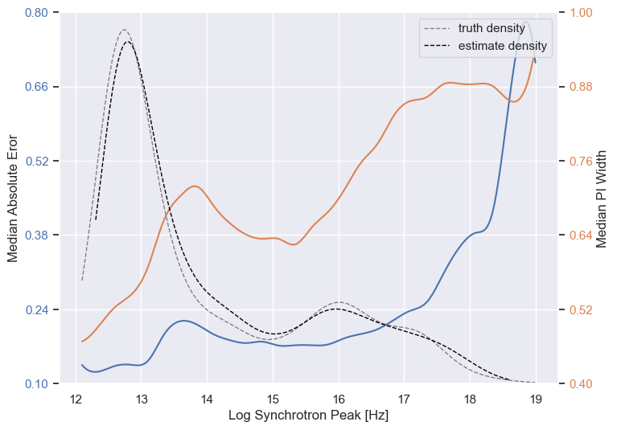
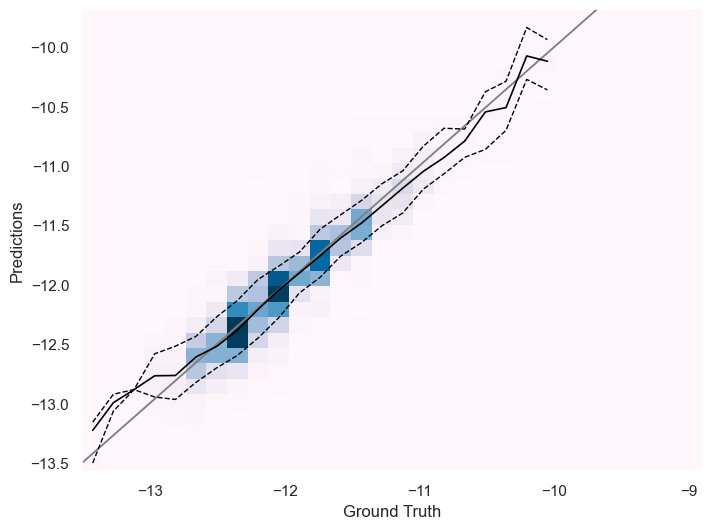
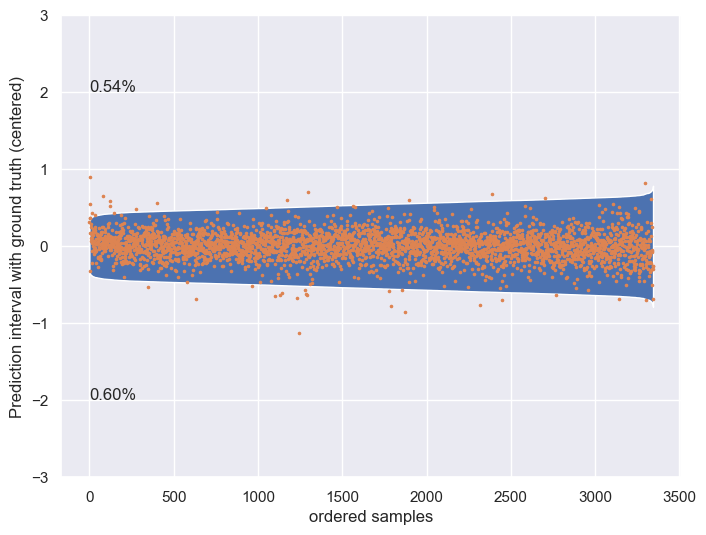
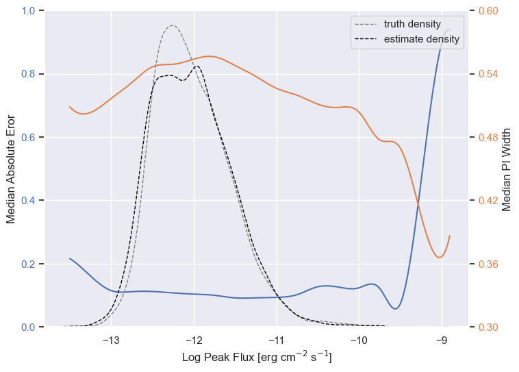

# BlaST

BlaST (**Bla**zar **S**ynchrotron **T**ool) is a tool to estimate the
synchrotron peak of blazars given its spectral energy distribution. The package is available on pip
and can simply be installed via

```
pip install astroblast
```

Running the tool is as simple as typing

```
blast sed.txt
```

where `sed.txt` is a output file generated by the *VOUBlazar* tool and might look something like the following:

```
   1  matched source  227.16230  -49.88400  99
 Frequency     nufnu     nufnu unc.  nufnu unc. start time   end time   Catalog     Reference
    Hz       erg/cm2/s     upper       lower        MJD         MJD   
---------------------------------------------------------------------------------------------------------------------------
 2.418E+17   2.185E-13   3.139E-13   1.230E-13  55000.0000  55000.0000  RASS        Boller et al. 2016, A&A, 103, 1                                                                                                                                                                         
 2.418E+17   5.085E-13   6.281E-13   3.889E-13  58150.0000  58150.1016  OUSXB       Giommi et al. 2019, Accepted for publication in A&A  
```

This gives the following output:

```
12.42 (+/- 0.71)
```

The first value is the synchrotron peak and the second the 95% prediction interval both in `log10`. It is possible to specify a different prediction interval width by the `-w` argument, followed by the width in sigmas:

```
blast sed.txt -w 1.0
```

BlaST also supports bulk estimation, e.g. estimating a whole catalogue, by providing a directory or zip file containing
the seds as well as an output file in which the results will be written to as csv:

```
blast seds.zip -o estimates.csv
```

With V2 you now also have the option to estimate the synchrotron peak flux (`erg/cm2/s`), again in `log10`.
You enable this with the `-f` flag:

```
-12.39 (+/- 0.63) @ 12.39 (+/- 0.39)
```

## Changes from v1 to v2

With v2 there has been some major changes. Some are listed in the following:

- **New data set** (courtesy of N. Krieger)  
The data set has been refined resulting in a new set independent of the previous
one. This one now also includes labels for the flux.
- **Flux estimate**  
Biggest difference is the estimation of the synchrotron peak's flux by an
independent ensemble of neural networks.
- **Save models in ONNX format**  
Previously, the tool needed pytorch installed, which is quite large. We moved to
ONNX runtime to make the installation slimmer.

## How it works

BlaST consists of an ensemble of similar neural networks power by [pytorch](https://pytorch.org/) based on the method presented in 
[Lakshminarayanan et. al. 2016][2]. The data set (see `SEDs.zip`) is based on the three catalogues [4LAC][3], [3HSP][4]
and [5BZCat][5] and divided into 5 bags. For each bag an ensemble of 5 models are trained totalling 25 independent models.

The bagging allows the reapply the ensemble on the training data as an out-of-bag estimation, i.e. excluding the
ensemble members that were trained on a training set without that specific bag. The results are shown in `estimates.csv`.

For specific details, e.g. how the data was enhanced and how the bias in the data set was handles, take a look in
`BlaST.ipynb` which is the notebook used to train the models. Note that if you want to run that notebook you'll also
need to install [PyTorch Lightning](https://www.pytorchlightning.ai/)

## Performance

The performance was evaluated using out-of-bag estimates on the training data
including a 95% prediction interval. Metrics are shown as median and 25%/75%
quantile.
Since the model for predicting the peak frequency and peak flux are independent,
metrics are shown for both.

| Metric   | Value  | Freq  | Flux  |
|----------|--------|-------|-------|
| Abs Err  | Median | 0.163 | 0.104 |
|          | 25%    | 0.075 | 0.049 |
|          | 75%    | 0.314 | 0.186 |
| PI Width | Median | 1.267 | 1.087 |
|          | 25%    | 1.009 | 0.971 |
|          | 75%    | 1.625 | 1.198 |
| Interval | Median | 1.400 | 1.088 |
| Score    | 25%    | 1.010 | 0.972 |
|          | 75%    | 1.636 | 1.199 |

### Peak Frequency Estimate

The following show the prediction histogram with the median as black line, as well as the 90% and 10% quantile shown as
dotted lines



The next shows the prediction interval (95%) widths. The percentages above and below show the respective amount of samples
outside their intervals.



The final one shows the prediction error and the prediction interval distribution using a moving window and smoothed using cubic splines.



### Peak Flux Estimate

Same plots, but now for the peak flux estimate.





## Use BlaST in code

BlaST can also be imported as python package:

```python
from blast import *

sed, pos = parse_sed('sed.txt', position=True) #reads the file
bag = get_bag(pos) #Returns bag if sed was part of training
bins = bin_data(sed)

# estimate peak frequency
estimator = PeakFrequencyEstimator()
peak, err = estimator(bins, bag)
# estimate peak flux
estimator = PeakFluxEstimator()
peak, err = estimator(bins, bag)
```

## References

- [*Simple and Scalable Predictive Uncertainty Estimation using Deep Ensembles*, Lakshminarayanan et. al., 2016][2]
- [*The Fourth Catalog of Active Galactic Nuclei Detected by the Fermi Large Area Telescope*, The Fermit-LAT collaboration, 2019][3]
- [*The 3HSP catalogue of Extreme & High Synchrotron Peaked Blazars*, Chang et. al., 2019][4]
- [*The 5th edition of the Roma-BZCAT. A short presentation*, Massaro et. al., 2015][5]

[2]: https://arxiv.org/abs/1612.01474 "Lakshminarayanan et. al., 2016"
[3]: https://arxiv.org/abs/1905.10771 "The Fermit-LAT collaboration, 2019"
[4]: https://arxiv.org/abs/1909.08279 "Chang et. al., 2019"
[5]: https://www.ssdc.asi.it/bzcat/ "Massaro et. al. 2015"
